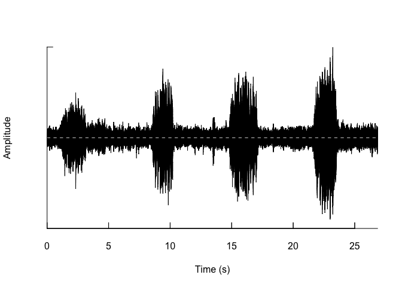
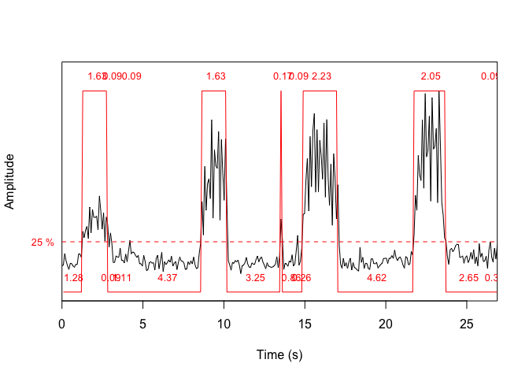
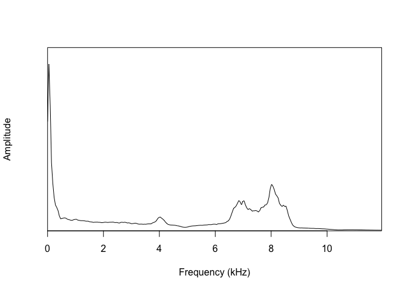
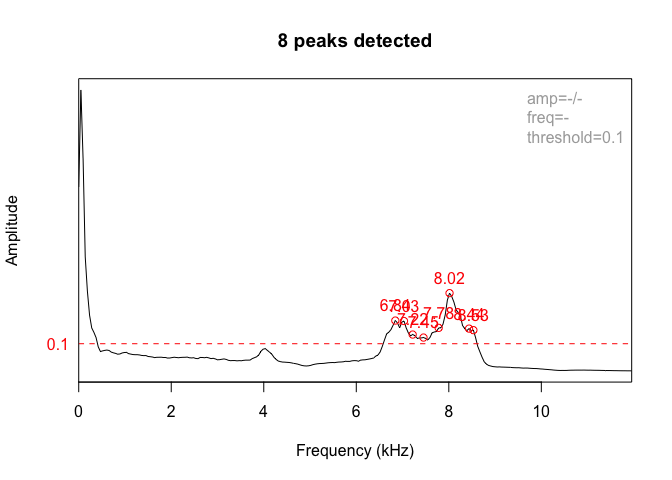
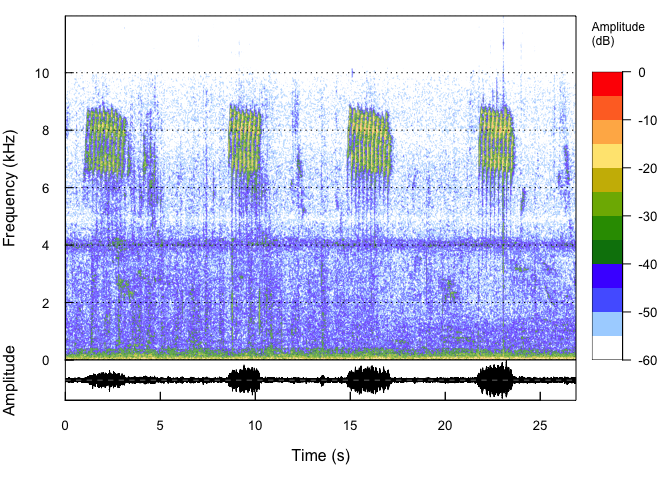

Manipulación básica de archivos en de audio en R
================
Juan Sebastián Ulloa
11/3/2020

Este repositorio tiene información esencial para comenzar a manipular
archivos de audio usando R.

## Dependencias

Se deben tener los siguientes paquetes instalados:

  - tuneR
  - seewave

Nota: para instalar un paquete se debe ejecutar el comando
`install.packages('<nombre del paquete>')`.

## Lectura de archivos de audio

El paquete `tuneR` tiene funciones simples que facilitan cargar y
evaluar los metadatos de archivos de audio en R.

``` r
library(tuneR)
s = readWave('./audio_ejemplo/pipra.wav')
# imprimir los atributos del objeto
print(s)
```

    ## 
    ## Wave Object
    ##  Number of Samples:      645188
    ##  Duration (seconds):     26.88
    ##  Samplingrate (Hertz):   24000
    ##  Channels (Mono/Stereo): Mono
    ##  PCM (integer format):   TRUE
    ##  Bit (8/16/24/32/64):    16

Los metadatos son almacenados en el objeto como atributos. Es posible
acceder a estos atributos usando la función `attributes` de R.

``` r
s_attrib = attributes(s)  
s_attrib$samp.rate
```

    ## [1] 24000

## La dimensión temporal y frecuencial de la señal

El paquete `seewave` permite calcular características en el dominio del
tiempo y de la frecuencia. Usando las funciones `oscilo` y `timer` vamos
a evaluar las dinámicas temporales, con `meanspec` vamos a evaluar el
contenido frecuencial, y con `spectro` vamos a observar las dinámicas en
ambas dimensiones.

``` r
library(seewave)
oscillo(s)
```

<!-- -->

``` r
timer(s, threshold = 25, msmooth = c(2048,0))
```

<!-- -->

``` r
mspec = meanspec(s, wl = 512)
```

<!-- -->

``` r
fpeaks(mspec, threshold = 0.1)
```

<!-- -->

``` r
spectro(s, wl = 1024, ovlp = 0.5, collevels = seq(-60, 0, 5), osc=T)
```

<!-- -->
